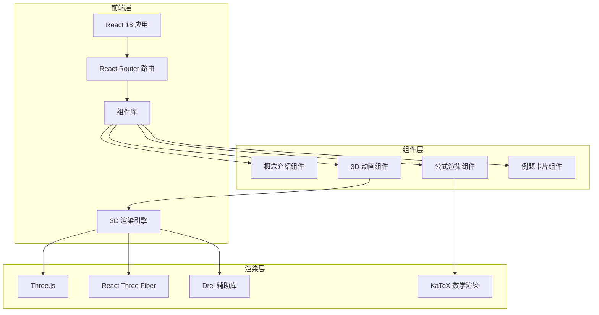

# 高数叉乘讲解网站 - 技术架构文档

## 1. 架构设计



## 2. 技术说明

- **前端框架**：React 18 + TypeScript
- **样式方案**：Tailwind CSS 3（实用优先的原子化 CSS）
- **构建工具**：Vite 5（快速开发和构建）
- **初始化方式**：`npm create vite@latest` + React + TypeScript 模板
- **3D 渲染**：
  - Three.js：底层 3D 库
  - @react-three/fiber：React 渲染器
  - @react-three/drei：实用组件库（OrbitControls、Text、Line 等）
- **数学公式**：KaTeX（快速数学公式渲染）
- **动画库**：Framer Motion（页面过渡和 UI 动画）
- **后端**：无（纯前端静态站点）
- **部署**：可部署到 Vercel、Netlify 或 GitHub Pages

## 3. 路由定义

| 路由 | 用途 |
|-----|------|
| `/` | 首页：叉乘概念介绍、几何意义动画、右手定则演示 |
| `/calculation` | 计算方法页：公式推导、计算步骤详解 |
| `/examples` | 例题练习页：三道典型例题及动画验证 |

## 4. 组件架构

### 4.1 核心组件

```
src/
├── components/
│   ├── layout/
│   │   ├── Layout.tsx          # 主布局（导航 + 内容区）
│   │   ├── Navigation.tsx      # 顶部导航栏
│   │   └── Footer.tsx          # 页脚
│   ├── home/
│   │   ├── ConceptIntro.tsx    # 概念介绍卡片
│   │   ├── CrossProduct3D.tsx  # 3D 叉乘动画场景
│   │   └── RightHandRule.tsx   # 右手定则动画
│   ├── calculation/
│   │   ├── FormulaDerivation.tsx # 公式推导步骤
│   │   └── CalculationSteps.tsx  # 计算流程演示
│   └── examples/
│       ├── ExampleCard.tsx     # 例题卡片容器
│       ├── Example1.tsx        # 例题1：基础计算
│       ├── Example2.tsx        # 例题2：单位向量
│       └── Example3.tsx        # 例题3：面积计算
├── utils/
│   ├── math.ts                 # 向量运算工具函数
│   └── constants.ts            # 常量定义（颜色、尺寸等）
└── pages/
    ├── HomePage.tsx
    ├── CalculationPage.tsx
    └── ExamplesPage.tsx
```

### 4.2 3D 场景组件

**CrossProduct3D.tsx**
- 使用 `@react-three/fiber` 的 `<Canvas>` 组件
- 向量表示：使用 `<Line>` 组件绘制带箭头的向量
- 动画：使用 `useFrame` 实现向量生长和旋转动画
- 交互：`<OrbitControls>` 支持鼠标旋转视角
- 辅助元素：网格平面、坐标轴、角度标注

**RightHandRule.tsx**
- 简化的手部模型（使用几何体组合）
- 拇指、食指、中指分别标注 x、y、z 方向
- 动画：手指依次 pointing 的演示动画

## 5. 数据结构

### 5.1 向量类型定义

```typescript
interface Vector3 {
  x: number;
  y: number;
  z: number;
}

interface Example {
  id: number;
  title: string;
  description: string;
  vectorA: Vector3;
  vectorB: Vector3;
  steps: string[];
  result: Vector3;
  verification: string;
}
```

### 5.2 例题数据

```typescript
const examples: Example[] = [
  {
    id: 1,
    title: "基础叉乘计算",
    description: "已知向量 a = (1, 2, 3)，b = (4, 5, 6)，求 a × b",
    vectorA: { x: 1, y: 2, z: 3 },
    vectorB: { x: 4, y: 5, z: 6 },
    steps: [
      "写出行列式形式",
      "计算 i 分量：2×6 - 3×5 = -3",
      "计算 j 分量：-(1×6 - 3×4) = 6",
      "计算 k 分量：1×5 - 2×4 = -3"
    ],
    result: { x: -3, y: 6, z: -3 },
    verification: "验证：(a×b)·a = 0，(a×b)·b = 0"
  },
  // ... 更多例题
];
```

## 6. 性能优化

- **3D 场景**：使用 `dpr={[1, 2]}` 限制像素比，避免高 DPI 设备性能问题
- **组件懒加载**：使用 `React.lazy` 和 `Suspense` 按需加载页面组件
- **动画优化**：3D 动画使用 `useFrame` 而非 state 更新，避免不必要的重渲染
- **代码分割**：路由级别代码分割，减小首屏加载体积
- **资源优化**：使用 SVG 替代图标字体，减少 HTTP 请求

## 7. 浏览器兼容性

- **目标浏览器**：Chrome 90+、Firefox 88+、Safari 14+、Edge 90+
- **WebGL 要求**：需要 WebGL 2.0 支持（用于 3D 渲染）
- **降级方案**：不支持 WebGL 的设备显示 2D 静态示意图
